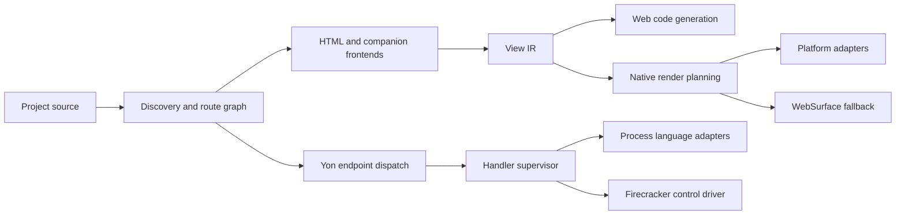
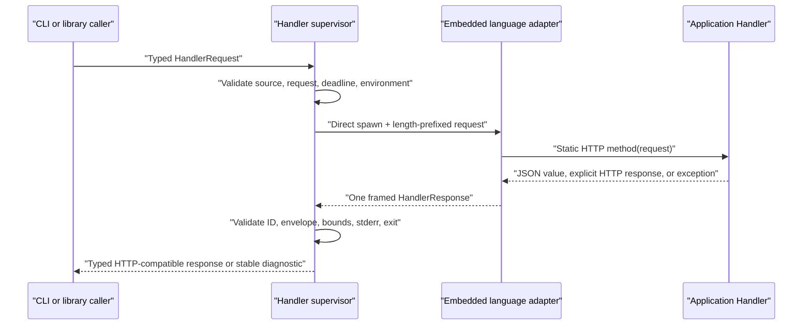
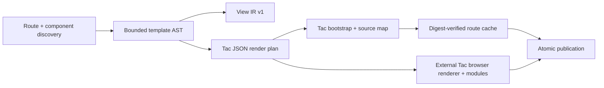
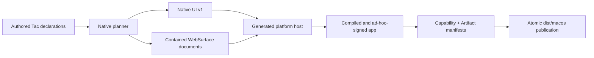

# Rust Rewrite Architecture

## Shape

Tachyon is a modular monolith. The command-line interface orchestrates typed
in-process modules; it does not introduce internal network services.

## Dependency Direction

- Diagnostics and public contract types have no dependency on compiler,
  server, runtime, or platform code.
- Discovery depends on project configuration and diagnostics.
- Frontends depend on diagnostics and emit validated source structures.
- Lowering depends on frontend structures and emits View IR.
- Web and native backends consume View IR; they do not modify it. Yon endpoints
  do not participate in the view pipeline.
- The handler supervisor depends on Handler Protocol, not on a language
  runtime's internal API.
- Platform adapters consume Native UI IR and declared capabilities.
- The CLI may depend on all orchestration modules. No library depends on the
  CLI.

Circular crate dependencies are forbidden. Cross-module callbacks use
consumer-owned traits only when a concrete dependency would invert the
direction above.

## Compiler Pipeline

1. Discover project files without executing application code.
2. Canonicalize project-relative paths and reject escapes or unsupported
   filesystem shapes.
3. Construct and validate a deterministic route graph.
4. Parse HTML and companions with source spans.
5. Resolve bindings, components, and control-tag structure.
6. Lower to versioned View IR.
7. Validate target capabilities and fallback boundaries.
8. Generate target output into a staging directory.
9. Verify the artifact manifest.
10. Atomically publish the completed output.

Every stage accepts immutable input and returns either immutable output or a
bounded set of stable diagnostics.

## Web Compiler and Server

`tachyon-cli` owns argument and diagnostic presentation. `tachyon-core` owns
project discovery, the static route graph, bounded HTML tokenization, staged
publication, scaffolding, and the development server. `tachyon-contracts` owns
Route Manifest v1 and repository policy tests; `tachyon-diagnostics` owns
Diagnostics v1.

The compiler emits Tac routes as deterministic bootstrap documents plus
bounded client render plans; it never renders Tac view structure on the
server. Yon is not a compiler frontend and `yon.html` is rejected. The compiler
also emits View IR, source maps, client modules, shared assets, and an offline service worker into a staged
directory before atomic publication. The server consumes that generated
output, matches exact or dynamic route patterns, dispatches Yon REST handlers and
middleware through the supervisor, and retains the last good build after a
failed watched rebuild. In development, an event-driven watcher classifies a
successful source change as a stylesheet update, client render-plan update,
or safe full-reload fallback and publishes Hot Update Protocol v1 over SSE.
Diagnostics retain the running page. The client is injected while serving and
does not enter production artifacts; see ADR 0013.

## Handler Data Path

`tachyon-core::handler` owns source validation, framing, runtime adapter
materialization, environment policy, concurrency admission, process lifecycle,
and response validation. `tachyon-contracts` owns the typed public envelope
shapes. `tachyon-cli` translates command arguments and Ctrl-C into one
invocation; it does not parse adapter-specific output.

The supervisor selects its isolation backend exclusively from the parent
process environment. Process mode spawns one language child per request;
Firecracker mode spawns a trusted control client which delegates the same
framed request to an operator-owned microVM pool. Neither project files nor
handler requests can weaken that selection. See ADR 0014.

The supervisor spawns its child or control client without a shell. Protocol stdout
accepts exactly one bounded frame while stderr is drained independently and
bounded. Queueing, startup, execution, framing, and exit share one deadline.
Cancellation sends the protocol cancel frame, waits a short grace period, then
kills and reaps when required. Process-mode handlers are never pooled or
reused.

The built-in JavaScript and Python adapters turn ordinary return values into
JSON responses. A handler may instead return `{status, headers, body}`; an
explicit `Content-Type: text/html` body passes through unchanged. No Yon
response is interpreted as a Tachyon template.

The server invokes this path for HTTP dispatch, middleware, and scheduled
workers. Builds never invoke it. A Firecracker control program may address a
warm pool, but pool and snapshot correctness remain its qualified deployment
responsibility.

## View Data Path

`tachyon-core::template` owns expression parsing, control validation, component
resolution, client-plan encoding, and source mapping. The compiler validates
every view without executing handlers, treats prior build state as untrusted,
and publishes only a complete staged output. At runtime, the bounded Tac
renderer creates the entire Tac DOM and owns structural rerenders. Yon remains
an independent HTTP dispatch path.
Cross-document navigation remains browser-native. See ADR 0015.

## Native Data Path

`tachyon-core::native` owns strict application configuration, semantic adapter
selection, deterministic identities, controller state validation, WebSurface
boundaries, generated host source, toolchain execution, manifests, and atomic
publication. SwiftUI/UIKit, Android platform views, GTK4, and Win32 common
controls consume one Native UI contract. Unsupported safe subtrees use local
WKWebView, Android WebView, or WebKitGTK surfaces where available; Windows
retains its documented placeholder reduction until WebView2 evidence exists.
Same-origin surface links return to the native route stack. Remote content
requires HTTPS, stays on its declared host, and never receives a native bridge.

## Compatibility Boundary

There is no in-tree legacy framework implementation. `website/` builds through
Rust and acts as a real migration and multi-target acceptance project. The
immutable v26.30.04 release binary is the external behavioral oracle, and
`corpus/` contains the neutral fixtures shared by both implementations.

New compatibility fixtures must identify the observable behavior being
preserved and must not embed private implementation logic, generated caches,
private data, or incidental implementation details.
