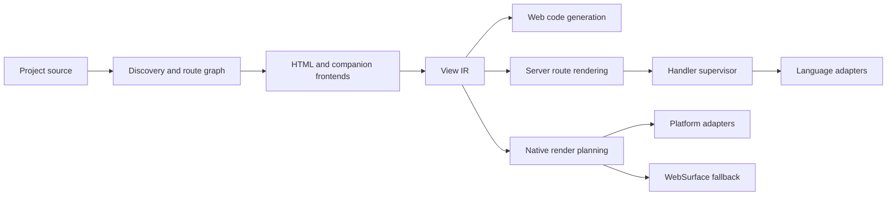
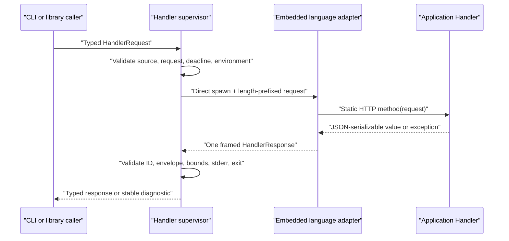
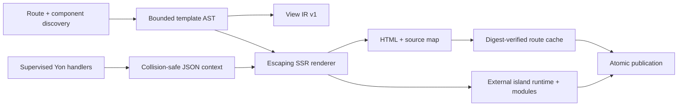
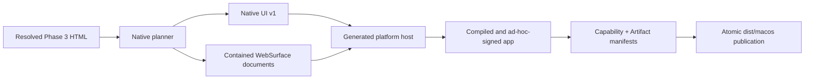

# Rust Rewrite Architecture

## Shape

Tachyon is a modular monolith. The command-line interface orchestrates typed
in-process modules; it does not introduce internal network services.

## Dependency Direction

- Diagnostics and public contract types have no dependency on compiler,
  server, runtime, or platform code.
- Discovery depends on project configuration and diagnostics.
- Frontends depend on diagnostics and emit validated source structures.
- Lowering depends on frontend structures and emits View IR.
- Web, server, and native backends consume View IR; they do not modify it.
- The handler supervisor depends on Handler Protocol, not on a language
  runtime's internal API.
- Platform adapters consume Native UI IR and declared capabilities.
- The CLI may depend on all orchestration modules. No library depends on the
  CLI.

Circular crate dependencies are forbidden. Cross-module callbacks use
consumer-owned traits only when a concrete dependency would invert the
direction above.

## Compiler Pipeline

1. Discover project files without executing application code.
2. Canonicalize project-relative paths and reject escapes or unsupported
   filesystem shapes.
3. Construct and validate a deterministic route graph.
4. Parse HTML and companions with source spans.
5. Resolve bindings, components, and control-tag structure.
6. Lower to versioned View IR.
7. Validate target capabilities and fallback boundaries.
8. Generate target output into a staging directory.
9. Verify the artifact manifest.
10. Atomically publish the completed output.

Every stage accepts immutable input and returns either immutable output or a
bounded set of stable diagnostics.

## Web Compiler and Server

`tachyon-cli` owns argument and diagnostic presentation. `tachyon-core` owns
project discovery, the static route graph, bounded HTML tokenization, staged
publication, scaffolding, and the development server. `tachyon-contracts` owns
Route Manifest v1 and repository policy tests; `tachyon-diagnostics` owns
Diagnostics v1.

The compiler preserves full HTML documents or wraps fragments in a
deterministic shell. It emits View IR, source maps, route templates, island and
event modules, shared assets, and an offline service worker into a staged
directory before atomic publication. The server consumes that generated
output, matches exact or dynamic route patterns, dispatches handlers and
middleware through the supervisor, and retains the last good build after a
failed watched rebuild.

## Handler Data Path

`tachyon-core::handler` owns source validation, framing, runtime adapter
materialization, environment policy, concurrency admission, process lifecycle,
and response validation. `tachyon-contracts` owns the typed public envelope
shapes. `tachyon-cli` translates command arguments and Ctrl-C into one
invocation; it does not parse adapter-specific output.

The supervisor spawns one child per request without a shell. Protocol stdout
accepts exactly one bounded frame while stderr is drained independently and
bounded. Queueing, startup, execution, framing, and exit share one deadline.
Cancellation sends the protocol cancel frame, waits a short grace period, then
kills and reaps when required. Processes are never pooled or reused.

The server invokes this path for HTTP dispatch, middleware, and scheduled
workers. Static handler fields and the selected method result contribute to
route context in deterministic source order; duplicate keys fail before
rendering. Processes are not pooled or reused.

## View Data Path

`tachyon-core::template` owns expression parsing, control validation, component
resolution, route-context composition, rendering, island metadata, and source
mapping. The compiler validates every view before executing handlers, lowers
View IR before evaluation, treats prior build state as untrusted, and publishes
only a complete staged output. At runtime, bounded island modules activate only
the subtrees whose hydration policy permits it. Cross-document navigation
replaces the legacy client renderer; state that must survive navigation belongs
in an island, storage, or the server.

## Native Data Path

`tachyon-core::native` owns strict application configuration, semantic adapter
selection, deterministic identities, controller state validation, WebSurface
boundaries, generated host source, toolchain execution, manifests, and atomic
publication. SwiftUI/UIKit, Android platform views, GTK4, and Win32 common
controls consume one Native UI contract. Unsupported safe subtrees use local
WKWebView, Android WebView, or WebKitGTK surfaces where available; Windows
retains its documented placeholder reduction until WebView2 evidence exists.
Same-origin surface links return to the native route stack. Remote content
requires HTTPS, stays on its declared host, and never receives a native bridge.

## Legacy Boundary

The existing `src/` and legacy `tests/` trees describe the released JavaScript
implementation. `website/` now builds through Rust and acts as a real migration
and multi-target acceptance project. New Rust crates must not import, shell out
to, or copy private implementation logic from the legacy tree.

Legacy fixtures and observable behavior may be promoted into neutral
compatibility fixtures. Such promotions must identify the behavior being
preserved and must not embed generated caches, private data, or incidental
implementation details.
