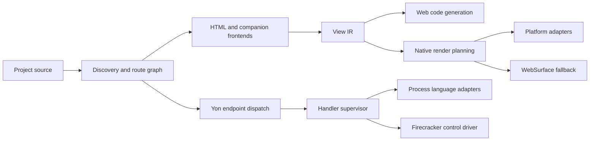
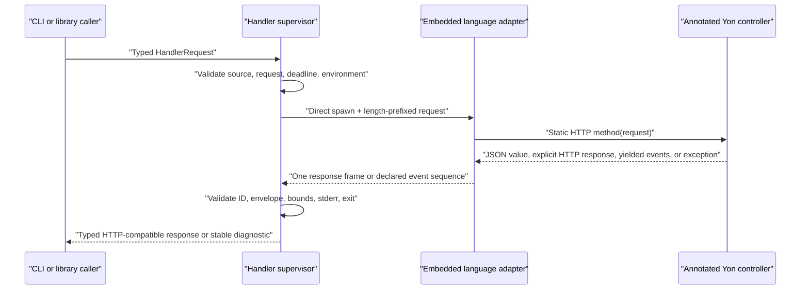
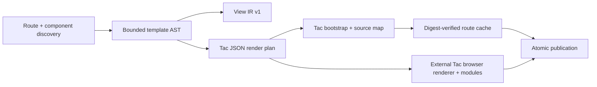
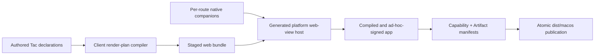

# Rust Rewrite Architecture

## Shape

Tachyon is a modular monolith. The command-line interface orchestrates typed
in-process modules; it does not introduce internal network services.

External build tools are framework-owned process trees: stdout and stderr are
drained concurrently into fixed-size diagnostic buffers, an absolute tool
deadline covers execution, and descendants are terminated and reaped even when
their parent exits successfully. Development topic SSE uses a runtime-owned
hub, not a reader per client; each topic has one incremental reader, bounded
replay and broadcast buffers, and explicit global/per-topic admission.

## Dependency Direction

- Diagnostics and public contract types have no dependency on compiler,
  server, runtime, or platform code.
- Discovery depends on project configuration and diagnostics.
- Frontends depend on diagnostics and emit validated source structures.
- Lowering depends on frontend structures and emits View IR.
- Web and native backends consume View IR; they do not modify it. Yon endpoints
  do not participate in the view pipeline.
- The handler supervisor depends on Handler Protocol, not on a language
  runtime's internal API.
- Platform web-view hosts consume the client bundle and declared capabilities.
- The CLI may depend on all orchestration modules. No library depends on the
  CLI.

Circular crate dependencies are forbidden. Cross-module callbacks use
consumer-owned traits only when a concrete dependency would invert the
direction above.

## Compiler Pipeline

1. Discover project files without executing application code.
2. Canonicalize project-relative paths and reject escapes or unsupported
   filesystem shapes.
3. Construct and validate a deterministic route graph.
4. Parse HTML and companions with source spans.
5. Resolve bindings, components, and control-tag structure.
6. Lower to versioned View IR.
7. Validate target capabilities and fallback boundaries.
8. Generate target output into a staging directory.
9. Verify the artifact manifest.
10. Atomically publish the completed output.

Every stage accepts immutable input and returns either immutable output or a
bounded set of stable diagnostics.

## Web Compiler and Server

`tachyon-cli` owns argument and diagnostic presentation. `tachyon-core` owns
project discovery, the static route graph, bounded HTML tokenization, staged
publication, scaffolding, and the development server. `tachyon-contracts` owns
Route Manifest v1 and repository policy tests; `tachyon-diagnostics` owns
Diagnostics v1.

The compiler emits Tac routes as deterministic bootstrap documents plus
bounded client render plans; it never renders Tac view structure on the
server. Yon is not a compiler frontend and `yon.html` is rejected. The compiler
also emits View IR, source maps, client modules, shared assets, and an offline service worker into a staged
directory before atomic publication. The server consumes that generated
output, matches exact or dynamic route patterns, dispatches Yon REST handlers and
middleware through the supervisor, and retains the last good build after a
failed watched rebuild. In development, an event-driven watcher classifies a
successful source change as a stylesheet update, client render-plan update,
or safe full-reload fallback and publishes Hot Update Protocol v1 over SSE.
Diagnostics retain the running page. The client is injected while serving and
does not enter production artifacts; see ADR 0013.

## Handler Data Path

`tachyon-core::handler` owns source validation, framing, runtime adapter
materialization, environment policy, concurrency admission, process lifecycle,
and response validation. `tachyon-contracts` owns the typed public envelope
shapes. `tachyon-cli` translates command arguments and Ctrl-C into one
invocation; it does not parse adapter-specific output.

Project discovery opens one capability root and reads Tac pages, components,
shared assets, web/native configuration, Yon, and the complete server source
boundary without following any component. The route graph retains captured
Tac/companion bytes and the project owns one private project-shaped snapshot.
Web compilation, native planning, and supervised handler execution reuse that
snapshot, including their working directories; native compilation never
rediscovers the project. Development-server startup also derives its initial
web build, route dispatch, selected root middleware, worker schedules, and
worker HandlerSources from this one Project. Replacing an authored file or
ambient project root after discovery cannot redirect an input. A hot-update
rebuild performs one new discovery and builds from that fresh snapshot. Before
output preparation, socket binding, route/middleware readiness, or worker
startup, the server resolves and probes the deduplicated runtime requirements
from those HandlerSources. The same ordering holds for `--no-bundle`, while a
static-only Project has an empty runtime requirement set. JavaScript and
TypeScript share the selected JavaScript runtime; Java and Kotlin share the
Java runtime, with Kotlin retaining its compiler requirement. Firecracker mode
validates the exact discovered language set and configured driver before the
server can become observable. C# readiness resolves the installed SDK major and
builds a framework-owned minimal project with isolated temporary CLI and NuGet
state; listing `Microsoft.NETCore.App` alone is not readiness. The
development server owns the watcher and every scheduled-worker task: they
start with `run_until`, receive cooperative cancellation at shutdown, and are
awaited under a bounded settlement deadline before the server returns. Dropping
a bound server starts no tasks; dropping a running server future aborts every
owned task. Streaming-handler bridges, hot-update SSE, and topic SSE share that
runtime lifetime: shutdown closes producer admission, cancels active response
producers and request handlers before Axum drains connections, then force-closes
the HTTP future before the final reserved settlement slice. It then aborts and
join-drains both task registries under the one global deadline. Completed
producer records are reaped periodically while admission remains open rather
than growing with request count. Infinite streaming invocations receive their cancellation signal and are then
dropped through the supervised process-group guard rather than polled again;
this prevents a ready-loop producer from monopolizing shutdown while retaining
kill-and-reap semantics. The cooperative task drain yields every 16 joins.
A client disconnect also closes its bridge and
reaps its streaming child. Worker
schedules remain fixed to the startup Project for the life
of that server process, so changing `.tachyonrc.workers` requires a server
restart rather than replacing live schedules during a web hot rebuild.

The supervisor selects its isolation backend exclusively from the parent
process environment. Process mode spawns one language child per request;
Firecracker mode spawns a trusted control client which delegates the same
framed request to an operator-owned microVM pool for JavaScript and Python.
TypeScript and the prepared Java, PHP, Kotlin, C#, and Rust paths are rejected
before driver spawn because the current contract cannot transfer their
artifact sets. Neither project files nor handler requests can weaken that
selection. See ADR 0014.

The supervisor spawns its child or control client without a shell. Protocol
stdout accepts one bounded response frame, or a bounded sequence of event
frames from a method declared with `@Stream`, while stderr is drained
independently and bounded. Queueing, startup, execution, framing, and exit
share one deadline. Cancellation sends the protocol cancel frame, waits a
short grace period, then kills and reaps when required. Process-mode handlers
are never pooled or reused.

Runtime absence has a distinct `TY2112` mapping. The startup probe and the
subsequent process spawn use the same logical runtime identity, so an
executable removed between them still produces `TY2112` instead of a generic
spawn failure. Human diagnostics, JSON diagnostics, and structured invocation
events expose only a fixed runtime family/configuration label. Raw executable
paths and operating-system errors remain private.

Yon owns eight language paths: JavaScript, TypeScript, Python, Java, C#,
Kotlin, PHP, and Rust. Every source in the five server layer roots declares its
matching stereotype; discovery rejects an absent or misplaced declaration
before runtime selection. A handler may return `{status, headers, body}`; an
explicit `Content-Type: text/html` body passes through unchanged. No Yon
response is interpreted as a Tachyon template.

Other programs sit behind an `@Delegate` + `@Relay` edge. The per-language
prelude drains delegate stdout and stderr concurrently under fixed bounds and
sanitizes failures, while the supervisor owns the absolute request deadline
and the complete process group. `@Stream` methods yield framed events in the
six generator-capable languages (JavaScript, TypeScript, Python, PHP, Kotlin,
and C#); subscriber disconnect is a lifecycle event that terminates and reaps
the group. See ADR 0017.

The server invokes this path for HTTP dispatch, middleware, and scheduled
workers. Those entry points use the same eight-language boundary;
`.tachyonrc.workers` schedules but cannot register an interpreter. Root
middleware and workers are controller-shaped protocol entry points, and their
source, dependencies, and working directory are the Project's owned snapshot.
Builds never invoke them. A Firecracker control program may address a
warm pool, but pool and snapshot correctness remain its qualified deployment
responsibility. Its current transport is limited to JavaScript and Python.

## View Data Path

`tachyon-core::template` owns expression parsing, control validation, component
resolution, client-plan encoding, and source mapping. The compiler validates
every view without executing handlers, treats prior build state as untrusted,
and publishes only a complete staged output. At runtime, the bounded Tac
renderer creates the entire Tac DOM and owns structural rerenders. Yon remains
an independent HTTP dispatch path.
Cross-document navigation remains browser-native. See ADR 0015.

## Native Data Path

`tachyon-core::native` owns strict application configuration, target companion
selection, deterministic route registries, local-origin bridge boundaries,
generated host source, supervised toolchain execution, manifests, and atomic
publication. WKWebView, Android WebView, WebKitGTK, and WebView2 consume the
same client-rendered web bundle. Native page companions compile with ordinary
platform toolchains and are dispatched through a bounded, per-route registry.
Remote content and subframes never receive a native bridge. See ADRs 0018 and
0019 for the explicit migration from the released widget/WASM architecture.

## Compatibility Boundary

There is no in-tree legacy framework implementation. `website/` builds through
Rust and acts as a real migration and multi-target acceptance project. The
immutable v26.30.04 release binary is the external behavioral oracle, and
`corpus/` contains the neutral fixtures shared by both implementations.

New compatibility fixtures must identify the observable behavior being
preserved and must not embed private implementation logic, generated caches,
private data, or incidental implementation details.
